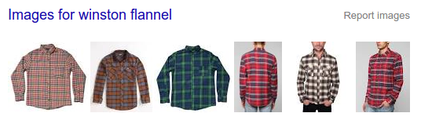

# flannel

[](https://greenkeeper.io/)

[![Build Status][ci-master]][travis-ci]
[![Coverage Status][coverage-master]][coveralls]
[![Dependency Status][dependency]][david]
[![devDependency Status][dev-dependency]][david]
[![Downloads][downloads]][npm]

[Winston][1] helper mixins for coffee-script classes

*"It's easy to handle logs when your coffee-script classes wear Flannel"*

[](https://www.google.com/search?q=winston+flannel&safe=off&tbm=isch)

[![NPM][npm-stats]][npm]

* [Installation](#installation)
* [Options](#options)
* [Methods](#methods)
* [Usage](#usage)
  - [Initialization](#initialization)
  - [Instance methods](#instance-methods)
  - [Class methods](#class-methods)
  - [With expressjs/morgan](#with-expressjsmorgan)
* [License](#license)

## Installation

```sh
npm install --save flannel
```

## Options

**logPrefix** *string*

the prefix to use when logging fns are called.  This belongs as a Class or Instance variable on the target Class.

**transports** *map*

the [**winston**][1] transports to use, and their options.  defaults to **console**:
```coffee
  console:
    level: "info"
```

*see also [Winston Transports](https://github.com/winstonjs/winston/blob/master/docs/transports.md)*

**Flannel.enabled** *bool*

set to false to squelch Flannel from sending logs.  defaults to `true`.

**Flannel.logLevels** *array*

the level names to use.  defaults to `["debug", " info", " warn", "  err"]`.

*see also [Winston#using-custom-logging-levels](https://github.com/winstonjs/winston#using-custom-logging-levels)*

**Flannel.logLevelColors** *map*

the colors for each log level.  names must match **logLevels**.  defaults to:
```coffee
  "  err": "red"
  " warn": "yellow"
  " info": "green"
  "debug": "blue"
```

**extending Flannel**

`@_dependencyMap` and all other class vars and methods can be overwritten.  Nothing is private.

## Methods

**Flannel.init(transports)** *returns `Flannel`*

Initialize the Flannel class.  It is designed as a singleton, so that logs from many classes are piped out through the same transports.

**Flannel.shirt(obj)**

Applies `Flannel.shirt()` to `obj`.

**Flannel.shirt()** *returns map*

Get the map of logLevels and their respective functions.  defaults to:
```coffee
  err:   (objs...) ->
  warn:  (objs...) ->
  info:  (objs...) ->
  debug: (objs...) ->
  log:   (objs...) -> # log() is an alias of debug() for convenience.
```

**Flannel.morgan(level = "info", format = "combined", options = {})**

Initalizes **[expressjs/morgan][2]** and pipes it into [**winston**][1].  No arguments are required.


## Usage

### Initialization
```coffee

Flannel = require "flannel"


Flannel.init
  Console:
    level: "debug"
  Logentries:
    token: "abcd-1234-xxxx"

```

### Instance methods
```coffee
class YourApp
  logPrefix: "(YourApp)"

  constructor: ->
    Flannel.shirt this
    @warn "timber"
    ...
```

### Class methods
```coffee
class YourSingleton
  @someMethod: ->
    ...

Flannel.shirt YourSingleton
YourSingleton.ClassMethod = -> @info "and I'm OK"
```

### With expressjs/morgan
```coffee
class ExpressApp
  constructor: ->
    app = express()
    app.use Flannel.morgan()
    Flannel.shirt this
```

## License

MIT Licensed.  (C) 2016 doublerebel

[1]: https://github.com/winstonjs/winston
[2]: https://github.com/expressjs/morgan


  [ci-master]: https://img.shields.io/travis/nextorigin/flannel/master.svg?style=flat-square
  [travis-ci]: https://travis-ci.org/nextorigin/flannel
  [coverage-master]: https://img.shields.io/coveralls/nextorigin/flannel/master.svg?style=flat-square
  [coveralls]: https://coveralls.io/r/nextorigin/flannel
  [dependency]: https://img.shields.io/david/nextorigin/flannel.svg?style=flat-square
  [david]: https://david-dm.org/nextorigin/flannel
  [dev-dependency]: https://img.shields.io/david/dev/nextorigin/flannel.svg?style=flat-square
  [david-dev]: https://david-dm.org/nextorigin/flannel#info=devDependencies
  [downloads]: https://img.shields.io/npm/dm/flannel.svg?style=flat-square
  [npm-stats]: https://nodei.co/npm/flannel.png?downloads=true&downloadRank=true&stars=true
  [npm]: https://www.npmjs.org/package/flannel
